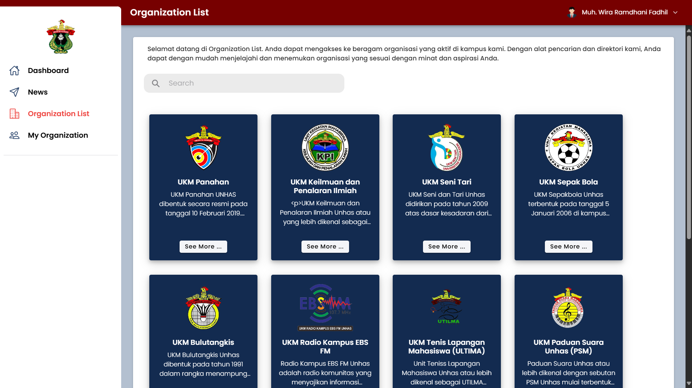
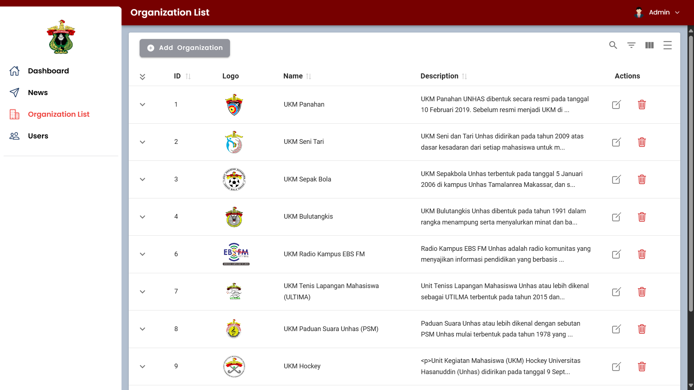
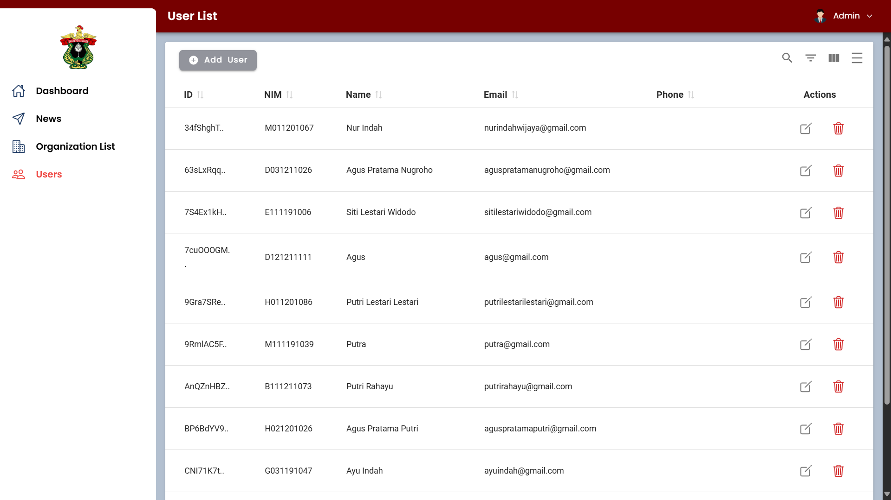

# Student Organization Management Information System

A comprehensive student organization management information system designed to facilitate and enhance the management of student organizations in a campus environment.

## Features

### User (Students)

1. **Dashboard**: Overview of active organizations, members, achievements, and visual trends.
2. **News**: Access and search organization-related news
3. **Organization List**: Browse and search for student organizations
4. **My Organization**: Manage memberships and access organization-specific information.

### Admins

1. **News Management**: Create, edit, and delete news articles
2. **Organization Management**: Manage organization details and status
3. **User Management**: Administer student accounts and access rights

## Technologies Used

- Frontend: React with Ionic Framework
- Backend: Firebase
- Database: Firestore Database
- Authentication: Firebase Authentication

## Screenshots

### User (Mahasiswa)

 <br> <br>
 <br> <br>
 <br> <br>
 <br> <br>
 <br> <br>
 <br> <br>

### Admin

 <br> <br>
 <br> <br>
 <br> <br>

## Getting Started

These instructions will get you a copy of the project up and running on your local machine for development and testing purposes.

### Prerequisites

Make sure you have the following installed on your local machine:

- [Node.js](https://nodejs.org/) (v14 or later recommended)
- [npm](https://www.npmjs.com/) (usually comes with Node.js)

### Installation

1. Clone the repository:

   ```
   git clone https://github.com/muhwira27/sistem-informasi-manajemen-organisasi-mahasiswa.git
   ```

2. Navigate to the project directory:

   ```
   cd sistem-informasi-manajemen-organisasi-mahasiswa
   ```

3. Install the dependencies:
   ```
   npm install
   ```

### Running the App

To start the development server:

```
npm run dev
```

This will start the app on [http://localhost:3000](http://localhost:3000). Production
